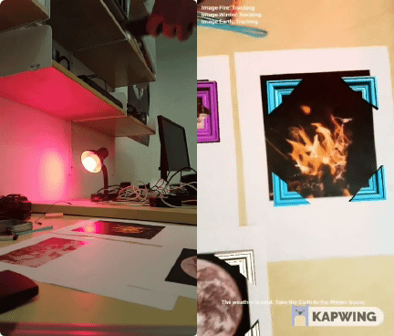

# UE4_AR_Augmented_Images_IoT_Demo

A simple demo application using Google ARCore to implement image detection based AR interaction. Based on the current temperature, the user is tasked to take the Earth image closer to either the Fire image or the Winter image. If the user follows the correct course of action, the Philips Hue lightbulb turns green. Otherwise, it turns red. 

# Prerequisites
1. An Android smartphone that is ARCore compatible
2. Va Rest Plugin for Unreal Engine
3. OpenWeatherAPI Application ID
4. REST endpoint of the Philips Hue lightbulb (IP address)
5. Home Assistant Authorization token

# Setup Instructions 
1. Clone this repository. 
2. Install the Va Rest Plugin for Unreal Engine at https://github.com/ufna/VaRest   
   a. Clone the Va Rest repository  
   b. Create a Plugins directory and put the Va Rest directory inside so that:  
      UE_AR_IoT_Demo/Plugins/VaRest-1.1-r26/Resources, Source, ...  
   c. In the DefaultEngine.ini configuration file, enable the Va Rest Plugin by adding:  
       [Plugins]  
       +EnabledPlugins=VaRestPlugin  
3. Open the project in Unreal Engine and navigate to the level blueprint of AugmentedImages.umap   
4. Find the 'Auth Token' local variable and {YOUR HASSIO AUTHORIZATION TOKEN} with your Home Assitant Authorization token in its default value. 
5. Find the 'Lamp Request URL' local variable and replace {YOUR IP ADDRESS} with the IP address and port of your Philips lighbulb's REST API
6. Navigate to the 'Weather UI' widget under the UI directory. 
7. Find the 'App ID' local variable and replace {YOUR OPENWEATHERAPI APP ID} with your OpenWeatherAPI App ID in its default value.
8. Compile, Save, and launch the application on your ARCore-compatible Android device.

# Demo 

